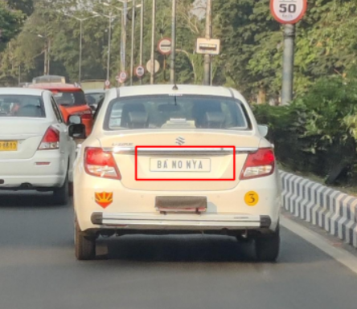
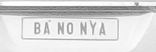

# License Plate Detection Using Haar Cascade

This project implements a **license plate detection system** using Python and OpenCV.
It uses the **Haar Cascade classifier** to locate license plates in an image, draws bounding boxes around them, and finally crops & saves the detected plate region.
An improvement—**Gaussian Blur preprocessing**—is added to increase detection accuracy.

---

## 📌 Features

* Loads and displays input images
* Converts images to grayscale
* Applies Gaussian blur for noise reduction
* Detects license plates using Haar Cascade
* Draws bounding boxes around detected plates
* Crops and saves the detected license plate region
* Uses Matplotlib for clear visualization in Jupyter Notebook

---

## 📂 Project Structure

```
License-Plate-Detection.ipynb   # Main notebook with full implementation
haarcascade_russian_plate_number.xml  # Haar Cascade classifier
car.jpg                         # Sample input image
README.md                       # Documentation
plate_output.jpg                # Cropped detected plate (output)
```

---

## 🛠️ Technologies Used

* Python 3
* OpenCV
* NumPy
* Matplotlib
* Haar Cascade Classifier

---

## ▶️ Steps Performed in the Notebook

### **1. Read and Display Image**

Reads the image using `cv2.imread()` and shows it using Matplotlib.

### **2. Convert to Grayscale**

Converts the image from BGR → Gray for Haar Cascade processing.

### **3. Apply Gaussian Blur (Improvement)**

Reduces noise and enhances the accuracy of detection.

### **4. Detect License Plates**

Uses:

```python
detectMultiScale(scaleFactor=1.1, minNeighbors=5)
```

### **5. Draw Bounding Boxes**

Marks detected plate regions with rectangles.

### **6. Crop and Save Plate**

Extracts the detected plate area and saves it as `plate_output.jpg`.

---

## 📦 Installation

Install dependencies:

```bash
pip install opencv-python matplotlib numpy
```

---

## ▶️ How to Run

1. Open the notebook:

   ```bash
   jupyter notebook plate-Detection.ipynb
   ```
2. Run all cells.
3. Detection result and cropped plate will appear in the output cells.

---

## 📝 Output

### Marked Image:


### Cropped Plate Image:


---

